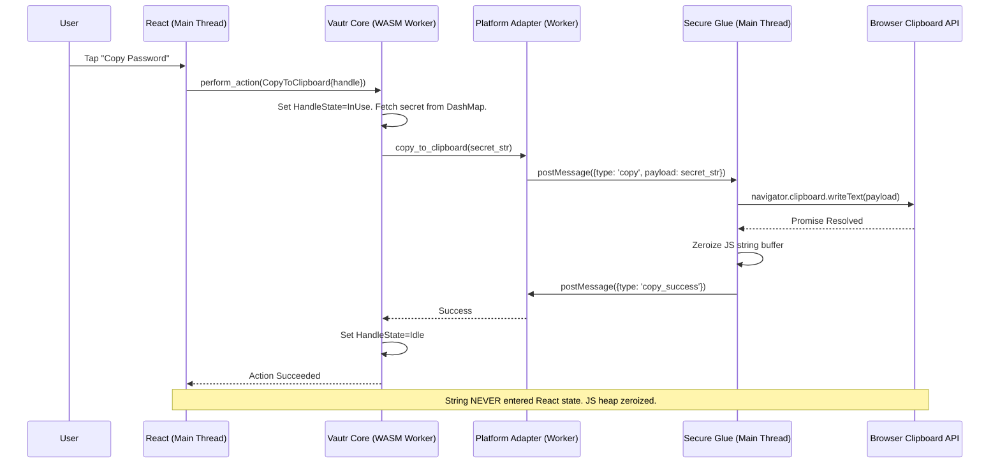
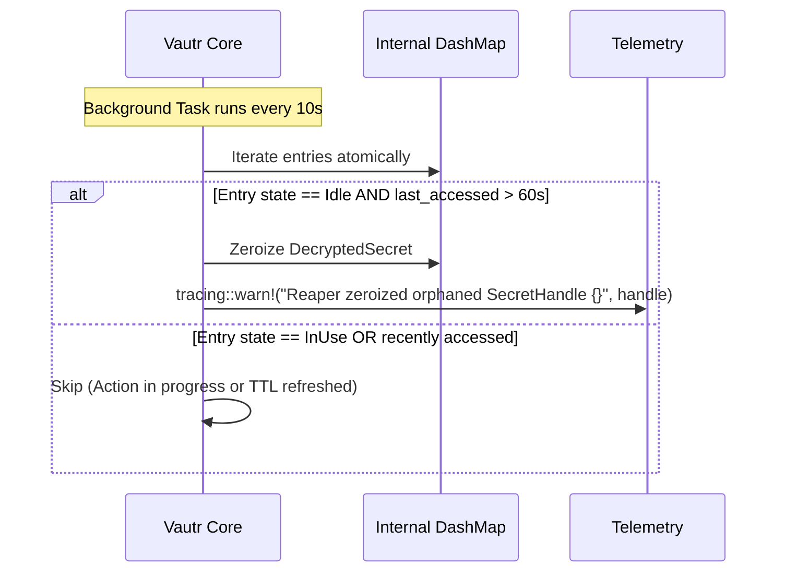
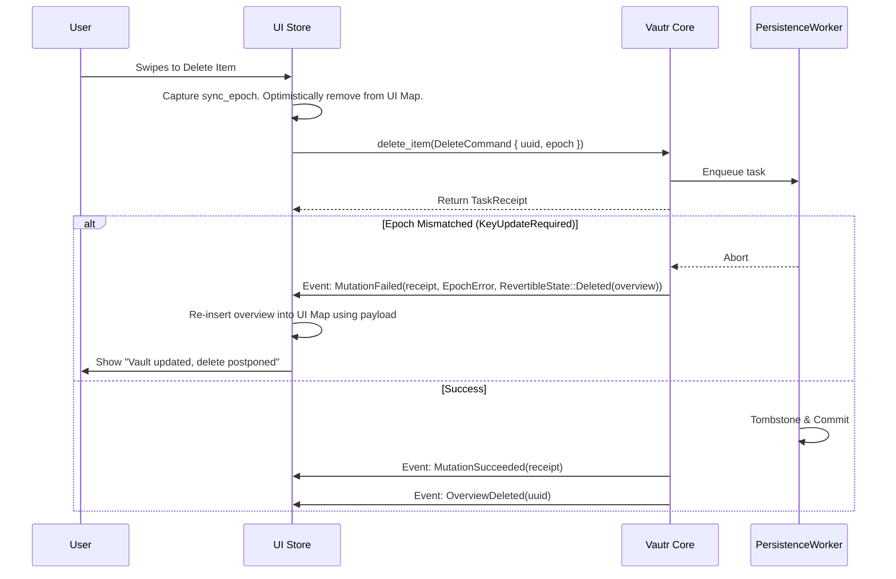

# Vautr Client Architecture: The Zero-Compromise Specification

## 1. Platform Matrix & Tech Stack

Vautr enforces a strict Hexagonal Architecture. The Rust core is a pure, asynchronous state machine. Platforms are thin adapters that render state, route user intent, and implement OS capability traits. **The API surface exposed to each platform is strictly limited at compile-time to prevent security boundary violations.**

| Platform | UI Framework | Core Binding | Exposed API Surface | Secret Rendering | Action Execution |
| :--- | :--- | :--- | :--- | :--- | :--- |
| **Desktop** | **GPUI** | Direct Rust | **Full API** (incl. `read_secret`) | GPUI native node | Rust closures |
| **Mobile** | **React Native** | UniFFI + Turbo Module | **Restricted API** (No `read_secret` to JS) | Native Overlay via `SecretHandle` | `CoreAction` Delegation |
| **Web** | **React** | WASM (`wasm-bindgen`) | **Restricted API** (No `read_secret` to JS) | Web Component via `SecretHandle` | `postMessage` Main Thread |

---

## 2. The Boundary Layer (The Core API)

The core API uses FFI-safe types. Lifetimes do not cross the boundary. Actions are delegated back to the platform adapter to prevent foreign heap string leaks. **API methods are gated by feature flags to enforce platform boundaries at compile time.**

```rust
// vautr-core/src/client_api.rs
use zeroize::Zeroizing;

pub struct VautrClient { /* Internal state */ }

// --- Commands & Revertible State ---
pub struct SaveCommand { pub item: DomainModel, pub sync_epoch: u64 }
pub enum RevertibleState {
    Saved(DomainModel),
    Deleted(DecryptedOverview),
}

// --- FFI-Safe Opaque Handle & Atomic State ---
pub type SecretHandle = u64;

#[derive(PartialEq)]
pub enum HandleState { Idle, InUse }

pub struct ActiveSecret {
    pub secret: DecryptedSecret,
    pub last_accessed: Instant,
    pub state: HandleState,
}

// --- Actions (Delegated to Platform Adapter) ---
pub enum CoreAction {
    CopyToClipboard { handle: SecretHandle },
    Autofill { handle: SecretHandle },
}

// --- Core Events ---
pub enum VaultStateUpdate {
    SyncStarted, SyncProgress(f32), SyncCompleted, SyncFailed(CoreError),
    OverviewUpserted(DecryptedOverview), OverviewDeleted(Uuid),
    ConflictDetected(ConflictEvent), KeyUpdateRequired, VaultLocked,
    NewerVersionAvailable { uuid: Uuid }, 
    MutationSucceeded(TaskReceipt),
    MutationFailed { receipt: TaskReceipt, error: CoreError, original_state: RevertibleState },
}

impl VautrClient {
    // --- Lifecycle (Pure Auth) ---
    pub async fn unlock_with_password(&self, mp: Zeroizing<String>) -> Result<(), AuthError>;
    pub async fn unlock_with_raw_key(&self, raw_key: Zeroizing<Vec<u8>>) -> Result<(), AuthError>; 
    pub fn lock(&self); 

    // --- Data Queries (Async, Non-Blocking) ---
    /// Searches vault using FTS5. 
    /// Contract: If `query` is empty `""`, returns top 50 items ordered by `last_used_at DESC, created_at DESC`.
    /// Otherwise, performs a full-text search on SQLite FTS5 indexes.
    pub async fn search(&self, query: &str) -> Result<Vec<DecryptedOverview>, CoreError>;
    pub async fn get_overview(&self, uuid: Uuid) -> Result<DecryptedOverview, CoreError>;

    // --- Secret Access (Opaque Handle Pattern) ---
    /// Decrypts secret and stores it in an internal DashMap, returning a U64 handle.
    /// Atomically sets HandleState to InUse.
    pub async fn reveal_secret(&self, uuid: Uuid) -> Result<SecretHandle, CoreError>;
    
    /// Delegates an action (Copy/Autofill) to the Platform Adapter.
    /// Atomically sets HandleState to InUse. Keeps secret in Rust memory.
    pub async fn perform_action(&self, action: CoreAction) -> Result<(), CoreError>;

    /// Explicit Disposal. Sets HandleState to Idle and immediately zeroizes memory.
    pub fn release_secret(&self, handle: SecretHandle) -> Result<(), CoreError>;

    // --- Restricted API: Desktop Only (GPUI Direct Render) ---
    #[cfg(feature = "desktop-api")]
    /// Reads the secret string. ONLY available on Desktop via feature flag.
    pub fn read_secret(&self, handle: SecretHandle) -> Result<Zeroizing<String>, CoreError>;

    // --- Mutations (Epoch-Aware) ---
    pub async fn save_item(&self, cmd: SaveCommand) -> Result<TaskReceipt, CoreError>;
    pub async fn delete_item(&self, cmd: DeleteCommand) -> Result<TaskReceipt, CoreError>;
    
    // --- State Subscriptions ---
    pub fn watch_state(&self) -> impl Stream<Item = VaultStateUpdate>;
}
```

---

## 3. The Safety Reaper & Platform Adapter

**The Safety Reaper (Crash Guard with Atomic State):**
The Reaper guarantees no secrets linger due to UI crashes, while preventing race conditions with active OS actions.
1.  The internal DashMap holds `ActiveSecret`.
2.  Calling `reveal_secret` or `perform_action` atomically sets `state = HandleState::InUse` and `last_accessed = Instant::now()`.
3.  Calling `release_secret` atomically sets `state = HandleState::Idle` and zeroizes memory.
4.  The Reaper runs every 10 seconds. It **only** zeroizes entries where `state == Idle` AND `last_accessed.elapsed() > 60 seconds`. If `InUse`, it skips.
5.  **Observability:** If the Reaper zeroizes an `Idle` entry, it emits `tracing::warn!("Reaper zeroized orphaned SecretHandle {}", handle)`.

**The Platform Adapter (WASM & Native Mapping):**
To copy or autofill, the UI calls `perform_action(CoreAction::CopyToClipboard { handle })`.
1.  **Mobile (Native):** The Core calls the Platform Adapter trait, which directly invokes the OS clipboard API via JNI/ObjC. The string never enters the JS/Kotlin heap.
2.  **Web (WASM Worker):** The Core runs in a Web Worker. The `PlatformAdapter` implementation uses a `postMessage` protocol to route the action to the main browser thread.
    *   *Main Thread:* The JS WASM glue code receives the action, reads the secret via a strictly internal worker-to-main channel, executes `navigator.clipboard.writeText()`, and immediately zeroizes the JS string buffer. The React app *never* sees this string; it only receives a "Action Succeeded" promise.

---

## 4. Compile-Time Platform API Enforcement

To prevent a developer from accidentally leaking secrets to the React Native or Web JS environment, the API surface is split using Rust feature flags and module visibility.

1.  **Desktop Build:** Compiled with `--features desktop-api`. The `read_secret` method is available. GPUI uses it to render strings directly.
2.  **Mobile/Web Build:** Compiled *without* the feature flag. `read_secret` does not exist in the compiled binary.
    *   **UniFFI (Mobile):** The Turbo Module wrapper simply has no method to call. The Native Overlay view communicates directly with the UniFFI-generated Swift/Kotlin classes, bypassing the JS bridge.
    *   **WASM (Web):** `wasm-pack` does not export `read_secret` to JavaScript. The Web Component `<vault-secret-text>` communicates directly with the WASM linear memory to render characters, completely bypassing the React state.

---

## 5. State Management & Reactive Subscriptions

The UI does not query the core for lists. The core pushes diffs. The UI reactively renders.

**UI State Architecture (React Native / Web):**
1.  **Normalized Store (Zustand/Redux):** Holds a Map of `Uuid -> DecryptedOverview`.
2.  **Initial Load:** On unlock, UI calls `search("")` to get the top 50 recently used items (ordered by `last_used_at`).
3.  **Update Flow:**
    *   Core pushes `OverviewUpserted(overview)`. UI updates Map. O(1) render.
    *   Core pushes `MutationFailed { original_state: RevertibleState::Deleted(overview), ... }`. UI uses the overview to surgically re-insert the item into the normalized store.

---

## 6. Lifecycle Flows

### The Copy Flow (Web Worker Action Delegation)


### The Safety Reaper Flow (Atomic State Guard)


### The Delete Flow (Surgical Optimistic Revert)

