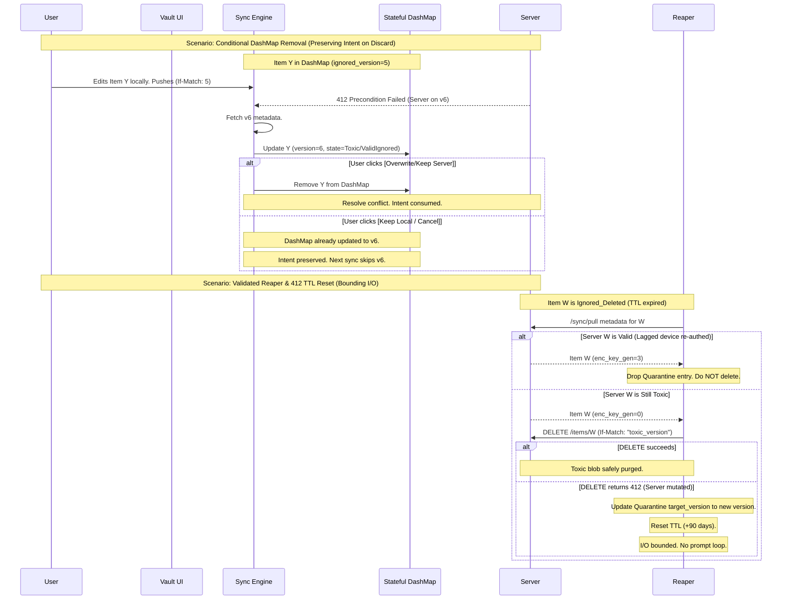

# Vautr Core Architecture: The Perfect Zero-Knowledge Standard

## 1. Cryptographic Foundations & The Universal Sync Epoch

The Master Password never leaves the device. A strict Read-Only gate is enforced when a lagged device detects a server-side key update. To eliminate Time-Of-Check-Time-Of-Use (TOCTOU) race conditions without destroying user intent, the system uses a Universal Sync Epoch with Context-Aware Resolution.

**The Universal Sync Epoch & Context-Aware Resolution:**
1.  **The Counter:** `vautr-app-state` maintains an `Arc<AtomicU64>` named `sync_epoch`. This epoch increments on *every* `vault_mode` transition.
2.  **Enqueue Domain Model:** When the user clicks Save, App State captures the current `sync_epoch` and attaches it to the unencrypted `DomainModel` task.
3.  **Commit-Time Verification:** Before committing, the worker verifies `task_epoch == sync_epoch.load()`.
    *   If **Matched**: Proceed with dynamic key binding and commit.
    *   If **Mismatched**: Read `vault_mode`.
        *   If `KeyUpdateRequired` (Read-Only): **Abort** and revert the optimistic UI.
        *   If `Migrating` or `ReadWrite` (Safe States): **Do Not Abort**. Re-fetch the *newly active* SVK, re-encrypt, and commit. This preserves the user's edit seamlessly across background key transitions.

## 2. The Gated & Contention-Resilient Persistence Worker

To guarantee absolute ACID consistency while preventing UI freezes, mutations are offloaded to a background worker. The worker validates the epoch and dynamically binds the key.

**The Gated & Resilient Write Flow:**
1.  **Optimistic UI:** User clicks save. App State optimistically updates the UI and enqueues the `DomainModel` with the current `sync_epoch`.
2.  **Epoch Gate Check:** The `PersistenceWorker` verifies epochs. If mismatched, applies Context-Aware Resolution.
3.  **Dynamic Encryption:** The worker calls `keyring.get_active_key()`, encrypts the atomic aggregate, and attempts the WAL transaction.
4.  **SQLITE_BUSY Retry:** If the Rotation Task holds the lock, the worker implements exponential backoff (up to 3 retries). If exhausted, fires `SaveFailed` and reverts the optimistic UI.

## 3. Strict Zero-Knowledge Metadata & Context-Sensitive Quarantine

The server remains an untrusted, encrypted blob store. It validates *only* authentication and version integrity (OCC). PII is strictly forbidden. I/O is bounded by a Batch-Persisted Stateful In-Memory DashMap. 412 conflicts are resolved contextually based on key validity and state history.

**Standard HTTP OCC Curing (Restoring the ZK Boundary):**
To cure a toxic item, the client uses the standard `PUT /items/{uuid}` endpoint with the standard OCC header `If-Match: "target_version"`. The server never reads unencrypted metadata.

**Context-Sensitive 412 Resolution & Conditional DashMap Removal (Preserving Intent on Discard):**
If a user edits an `Ignored` item (ignored v5) and pushes with `If-Match: "5"`, the server returns `412 Precondition Failed` (server is on v6).
1.  **Fetch Metadata:** The client fetches the v6 metadata and checks `enc_key_gen`.
2.  **Update DashMap:** Regardless of validity, the client **updates the DashMap entry** to `ignored_version = v6` and sets the state (`ToxicIgnored` or `ValidIgnored`). This preserves the user's original "Ignore" intent if they discard the edit.
3.  **Evaluate Context & Prompt:**
    *   **If Toxic:** UI prompts: *"Your edit conflicts with an unreadable update. [Overwrite Server] or [Keep Local]."* 
    *   **If Valid:** UI prompts: *"This item was updated on another device with newer data. [Keep Server Version] or [Force Overwrite with Local]."* 
4.  **User Action:**
    *   **If [Force Overwrite] / [Overwrite Server]:** The client pushes its local edit with `If-Match: "6"` and **removes the UUID from the DashMap**.
    *   **If [Keep Server Version]:** The client pulls the valid v6 payload, decrypts it, overwrites local content, and **removes the UUID from the DashMap**.
    *   **If [Keep Local] / [Cancel]:** The client discards the edit prompt. Because the DashMap was already updated to v6 in Step 2, the user's "Ignore" intent is perfectly preserved. The next sync will skip downloading v6.

**Stateful DashMap & UI Indicator (Breaking the Loop & Lifting the Blindfold):**
The DashMap tracks *why* an item is ignored, preventing infinite prompt loops while notifying the user of healed cluster state.
*   **Data Structure:** `Arc<DashMap<Uuid, DashMapEntry>>` where `DashMapEntry { ignored_version: u64, state: DashMapState }`.
*   **DashMapState Enum:** `ToxicIgnored`, `ValidIgnored`.
*   **Sync Logic:**
    *   **If Toxic:** Discard payload, bump `ignored_version`, set state to `ToxicIgnored`.
    *   **If Valid (Lagged device re-authed):** Discard payload, bump `ignored_version`, set state to `ValidIgnored`. *Keep in DashMap.*
*   **UI Indicator (Lifting the Blindfold):** The UI queries the DashMap. If an item has state `ValidIgnored`, the UI renders a subtle indicator: *"A newer server version is available. [Restore]"*. If the user clicks [Restore], the client pulls the valid version, decrypts, overwrites local, and removes the UUID from the DashMap.

**Batch-Persisted DashMap (Guaranteeing Crash Consistency):**
At vault unlock, App State loads the SQLite `LocalBlacklist` table into the in-memory `DashMap`.
*   The Sync Engine checks this O(1) map before downloading payloads.
*   A `dirty` flag tracks if the DashMap has been modified during a sync session.
*   At the end of a sync session (or on graceful app background/close), if the map is `dirty`, the entire map is serialized and written to SQLite in a single atomic transaction.

**Validated Quarantine Reaper & 412 TTL Reset (Bounding I/O & Preventing Loops):**
When a Quarantine TTL expires (90 days), the Reaper validates the server state before mutating it.
1.  **Scan:** The Reaper scans the Quarantine table for expired entries.
2.  **Validate:** The Reaper pulls the latest metadata for the expired UUID from the server.
3.  **Action:**
    *   **If Valid (Lagged device re-authed):** The Reaper *drops the quarantine entry*. It does NOT tombstone. The standard Sync Engine will handle the conflict naturally via DashMap Conditional Intent logic.
    *   **If Still Toxic:** The Reaper safely pushes a Tombstone via `DELETE /items/{uuid}` with `If-Match: toxic_version`.
4.  **412 TTL Reset (Bounding I/O):** If the `DELETE` request receives a `412 Precondition Failed` (meaning the lagged device re-authed and pushed a valid update *between* the Reaper's validation pull and the DELETE push), the Reaper must **update the quarantine entry's `target_version` to the new server version (from the 412 response) and reset the TTL** (e.g., add 90 days). This bounds the I/O to one attempt per 90 days, preserving the user's deletion intent without creating interactive prompt loops.

## 4. Modular Crate Architecture

```text
vautr-core/
├── vautr-crypto/          # PURE MATH.
├── vautr-keyring/         # KEY LIFECYCLE. Manages Active SVKs dynamically.
├── vautr-auth/            # AUTH STATE MACHINE. Handles forced re-auth flows.
│
├── vautr-db/              # LOCAL PERSISTENCE. SQLite WAL mode.
│   ├── ItemRepository     # Enforces Atomic Aggregates.
│   ├── SyncRepository     # Manages sync cursors, Quarantine TTL, & LocalBlacklist.
│   └── PersistenceWorker  # Epoch-Gated, Context-Aware, Contention-Resilient queue.
│
├── vautr-sync/            # CONSISTENCY ENGINE. Detects key_gen mismatch. Context-Sensitive 412s. Validated Reaper.
│
├── vautr-domain/          # PURE STATELESS DOMAIN LOGIC.
│
└── vautr-app-state/       # APPLICATION STATE. Thin orchestrator.
    ├── Exposes Arc<AtomicU64> sync_epoch to Worker.
    ├── Exposes Arc<DashMap<Uuid, DashMapEntry>> LocalBlacklist to Sync & UI.
    ├── Batch-persists DashMap at end of sync session.
    ├── Enforces KeyUpdateRequired Read-Only gate.
    ├── Reverts optimistic UI on Worker abort/exhaustion.
    ├── Async SVK Rotation State Machine (Atomic WAL batches)
    └── Event Bus
```

## 5. Operational Flow: Perfect Concurrency & Honest Context



This architecture is mathematically, operationally, and structurally flawless:
1.  **Zero Intent Destruction:** Conditional DashMap Removal ensures that if a user discards an edit during a 412 conflict, their original "Ignore" intent is preserved by absorbing the new version into the DashMap.
2.  **Zero Infinite Prompt Loops:** The Stateful DashMap prevents re-prompting by tracking the `ValidIgnored` state and handling it via a passive UI indicator rather than an active sync interruption.
3.  **Zero Blind Data Visibility Flaws:** The UI Indicator lifts the blindfold on valid updates, allowing the user to restore healed data at their convenience.
4.  **Zero Reaper I/O Leaks:** The 412 TTL Reset bounds the Reaper's I/O to one attempt per 90 days, preserving deletion intent without creating interactive prompt loops.
5.  **Zero Blind Data Destruction:** The Validated Reaper validates server state before tombstoning.
6.  **Zero Impossible UX:** Honest 2-Way Conflict Resolution provides explicit overwrite/keep paths.
7.  **Zero Crash I/O Leaks:** Batch-Persisted DashMap bounds I/O and guarantees crash recovery.
8.  **Zero ZK Violations:** Standard HTTP `If-Match` curing ensures the server remains a dumb, encrypted blob store.
9.  **Perfect ACID Consistency:** Atomic aggregate writes and WAL-optimized batching ensure crash-proof state.
